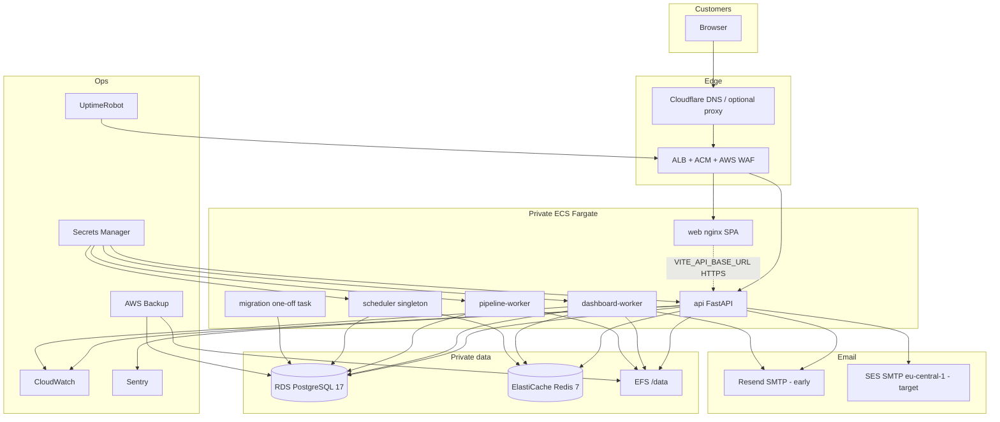

# VIP Production Architecture

**Status:** Target architecture for the first 1–5 customers.  
**Classification:** **INFRASTRUCTURE DEFINITION READY — LIVE ENVIRONMENT NOT VERIFIED.**  
**Audit SHA:** `dfb74af3ea4e44491fbee946a44e0e5e0e984bbf`  
**Date:** 23 August 2026  

No AWS account was applied during this audit. Diagrams below are the **intended** first-customer architecture, derived from `infra/aws/*`, `docker-compose.yml`, and application configuration. They are not proof of a running environment.

---

## Recommended option for first 1–5 customers

**Execute the existing AWS ECS/Fargate stack in `me-south-1` (Bahrain)** with Cloudflare DNS in front.

Do not throw away the Terraform that already exists. Railway/Render is an acceptable **bridge** for a 2–3 week paid pilot if AWS staging cannot be applied in time. It is not the destination architecture.

| Option | Cost class | When to use |
| --- | --- | --- |
| **Recommended:** AWS ECS/Fargate + RDS + ElastiCache + EFS + ALB + ACM + AWS Backup + SES (Frankfurt SMTP) + Cloudflare DNS | Moderate | First production customers; matches existing IaC and GCC hosting story |
| **Cheapest acceptable:** Render or Railway (web + API + worker + Postgres + Redis) + Cloudflare + Resend + volume for files | Low | Temporary founder-hosted pilot only |
| **Stronger enterprise later:** Same AWS account with Multi-AZ RDS, NAT HA, dedicated scheduler service, WAF tuned, DR vault in `me-central-1` | High | After 3–5 customers or a residency/SLA contract |

Kubernetes remains **intentionally rejected**. Five processes do not need a cluster.

---

## Minimum real product stack

| Layer | First-customer choice |
| --- | --- |
| DNS | Cloudflare (Free) as authoritative DNS |
| Domain | `app.<domain>`, `api.<domain>`, `mail.<domain>` (or SES/Resend sending domain) |
| TLS | Cloudflare Full (Strict) **or** ACM on ALB if Cloudflare is DNS-only |
| Frontend | ECS Fargate web image (`infra/containers/web`) behind ALB |
| API | ECS Fargate API image (`apps/api/Dockerfile`) |
| Worker | ECS Fargate dashboard-worker + pipeline-worker |
| Scheduler | ECS Fargate **singleton** (`desired_count = 1`) as designed in Terraform |
| PostgreSQL | Amazon RDS PostgreSQL 17, private subnets, encryption, PITR |
| Redis | ElastiCache Redis 7, TLS + AUTH |
| Files / artifacts | EFS (matches `FILE_STORAGE_PROVIDER=local` on a durable volume). S3 adapter is **not shipped**. |
| Email | **Resend SMTP now**; switch to SES SMTP (`eu-central-1`) when `infra/aws/email.tf` is applied |
| Secrets | AWS Secrets Manager (already in Terraform) |
| Logs | CloudWatch Logs (already in Terraform) |
| Errors | Sentry (not in repo; add) |
| Uptime | UptimeRobot or Better Stack (external) |
| Backups | AWS Backup on RDS + EFS (already in Terraform) |
| CI/CD | GitHub Actions quality-gate + `deploy-certified-release.yml` (workflow exists; execution **NOT VERIFIED**) |
| Staging | Required before production |
| Production | Separate Terraform `environment = "production"` |

### What must exist immediately

Domain, TLS, one running API+web+worker+scheduler, Postgres, Redis, durable files, real email, secrets, backups, uptime, error tracking, staging.

### What can be shared (1–5 customers)

Single AWS account, single VPC, single ECS cluster, single RDS, single Redis, single EFS. Tenant isolation is **in the application** (organization/workspace membership), not in separate clusters.

### What should be dedicated per customer later

Only if a contract requires it: separate AWS account, separate RDS, or KSA in-country region. Do not do this for customer #1.

---

## First-customer request flow

```text
Customer browser
  → Cloudflare (DNS; optional proxy/WAF)
  → ALB (HTTPS / ACM)
      → VIP Web (Nginx SPA)
      → VIP API (FastAPI)
           → RDS PostgreSQL (system of record)
           → ElastiCache Redis (sessions/rate-limit/job queue)
           → EFS (/data/vip-files, artifacts, pipeline artifacts)
           → Workers (dashboard export, pipeline runs)
           → Scheduler singleton (SKIP LOCKED ticks)
           → Email provider (Resend or SES SMTP)
  Secrets Manager → ECS task injection
  CloudWatch + Sentry + UptimeRobot → operators
  AWS Backup → RDS + EFS
```

### Security boundaries

- Public: Cloudflare + ALB 443 only.  
- Private: ECS tasks, RDS, Redis, EFS in private subnets.  
- Auth: HttpOnly cookies, CSRF double-submit, `AUTH_COOKIE_SECURE=true` in production (fail-closed in Settings).  
- Tenancy: `X-Organization-ID` / `X-Workspace-ID` membership-checked; cross-tenant **404**.  
- Secrets: never in images; Compose defaults are **local-only** and must not ship.  
- Email: transactional only; no marketing.  
- Files: ClamAV (or equivalent) required in production; Compose workers currently use `FILE_MALWARE_SCANNER=noop` — **must not** be copied to prod.  
- Admin: platform-admin routes separate from tenant admin.

---

## Architecture diagram (target)



---

## Process inventory vs Compose vs Terraform

| Process | Local Compose | AWS Terraform | Production required? |
| --- | --- | --- | --- |
| postgres | yes | RDS | yes |
| redis | yes | ElastiCache | yes |
| clamav | yes | sidecar / service | yes in prod |
| api | yes | ECS service | yes |
| web | `npm run dev` (not in Compose) | ECS web | yes |
| dashboard-worker | yes | ECS | yes |
| pipeline-worker | yes | ECS | yes |
| scheduler | **inside job worker ticks** | **dedicated singleton** | yes as singleton |
| migration | entrypoint / CLI | one-off ECS task | yes at deploy |
| mysql (connector tests) | profile only | no | no |

**Gap:** local topology does not match production (no web container in Compose, no dedicated scheduler). Staging must prove the **ECS** topology, not only Compose.

---

## Docker productionization

| Artifact | Path | Status |
| --- | --- | --- |
| API runtime | `apps/api/Dockerfile` | **Needs modification** — single-stage Alpine, non-root `vip`, no HEALTHCHECK in the Dockerfile (Compose defines one). Secrets not baked. |
| Web runtime | `infra/containers/web/Dockerfile` | **Already ready** for a first deploy — multi-stage Node → Nginx, non-root, HEALTHCHECK, Vite args, no secrets. |
| Postgres (local) | `infra/postgres/Dockerfile` | **Local only** — do not use in AWS (RDS instead). |
| Worker / scheduler | same API image, different command | **Already ready** as image; **needs** production env (SMTP, scanner ≠ noop, secure cookies, signing keys). |
| Migration | API image + alembic | **Already ready** as command; **needs** a one-off task in CD (Terraform defines this). |

### Acceptance before production images are used

- Built from a **frozen SHA**, tagged by digest, never `latest`.  
- Trivy: no unexceptioned Critical/High.  
- `APP_ENV=production` starts (fail-closed validators pass).  
- Health/ready succeed against RDS+Redis.  
- Non-root confirmed.  
- No Compose dummy keys in the running task definition.  
- Web `VITE_API_MODE=live` and HTTPS API origin.  
- Worker `FILE_MALWARE_SCANNER` is not `noop`.  
- `DASHBOARD_EMAIL_PROVIDER=smtp`.

---

## Storage reality

The application registers **only** `FILE_STORAGE_PROVIDER=local` (`apps/api/src/vip_api/files/storage.py`). Terraform mounts **EFS** at `/data`. That is a valid V1 pattern: a durable POSIX volume behind a local driver.

S3 is **not** an application storage backend today. Terraform S3 buckets are for ALB logs / recovery artifacts, not datasets.

**Production blocker if you run Compose-style named volumes on a single EC2 without backup.** EFS + AWS Backup is the designed fix.

---

## Email reality

| Environment | Provider | Evidence |
| --- | --- | --- |
| API `.env.example` | `disabled` | send fails; password reset still returns 202 |
| Compose | `file` | `.eml` under `/data/vip-email-outbox` |
| Production Settings | **must be `smtp`** | fail-closed |
| Terraform | SES domain identity + SMTP secret in `eu-central-1` | **NOT APPLIED** |
| Resend | not in code | recommended bridge; SMTP-compatible |

Password reset is wired. Invitation email is **not sent**. Dashboard delivery email is wired to the same provider.

---

## Observability minimum (affordable)

Do **not** install Grafana+Prometheus+Loki on day one.

| Need | Tool |
| --- | --- |
| Uptime | UptimeRobot or Better Stack (HTTPS probes on `/health` and login) |
| Errors | Sentry (API + Vue) |
| Logs | CloudWatch (already in IaC) or host logs on Railway |
| Alarms | RDS CPU/storage, Redis, 5xx on ALB, worker exit |
| Audit | Application `AUDIT_EVENTS_ENABLED=true` (already required in production) |

OpenTelemetry and a full metrics mesh are **defer**.

---

## Backup / DR (recommended targets, not contractual SLAs)

| Item | V1 recommendation |
| --- | --- |
| RPO | **1 hour** target (RDS PITR + daily AWS Backup) |
| RTO | **8 hours** target (restore into staging-shaped env, cut DNS) |
| RDS | Automated backups + PITR, 7–35 day retention |
| EFS | AWS Backup daily |
| Object/config | Terraform state in encrypted S3 backend; never only on a laptop |
| Restore test | **Required once in staging before production** — local restore drill is **not** sufficient (`docs/operations/LOCAL_RESTORE_DRILL.md` is local-only) |

Do not print these numbers in a customer SLA until they have been tested.

---

## Staging verdict

**Staging is required before first production onboarding.**

A competent engineer can break production with a bad migration, cookie domain, or CORS origin. Staging must have: separate DB/Redis, real HTTPS hostnames, SMTP sandbox/Resend test domain, test accounts, and the smoke list in `docs/operations/VIP_V1_STAGING_SMOKE_TEST.md`.

---

## Cost awareness (no fabricated bills)

| Choice | Cost class | Risk if skipped |
| --- | --- | --- |
| Cloudflare Free DNS | Very low | Weak DNS/WAF story; still OK if AWS WAF is live |
| Resend (free/pro) | Very low / Low | Password reset and invites do not work |
| Render/Railway pilot | Low / Moderate | Easy start; later migration; weaker GCC residency story |
| ECS + RDS + Redis + EFS + ALB (single-AZ staging) | Moderate | This is the real product |
| Multi-AZ RDS + dual NAT + DR region | High | Not needed for customer #1 |
| Cloudflare Enterprise / Bot Fight paid | High | Not needed |
| Dedicated K8s | High | Unnecessary complexity |

**Save money now:** skip K8s, skip second region, skip paid Cloudflare, skip Grafana, skip per-tenant accounts.  
**Do not save money on:** RDS backups, TLS, secrets, email, malware scanning, a second environment (staging).

---

## Saudi / GCC note

Bahrain `me-south-1` is **GCC hosting, not KSA PDPL in-country residency**. SES/Resend process email in the EU or vendor regions. Legal and the customer must approve this **in writing** before production data is loaded. This audit is not a PDPL certification.
