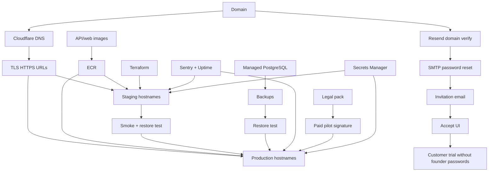

# VIP Productization Roadmap

**Date:** 23 August 2026  
**SHA:** `dfb74af3ea4e44491fbee946a44e0e5e0e984bbf`  
**Verdict this roadmap serves:** **C — PILOT READY ONLY** toward a first production customer.

This is an execution sequence, not a brainstorm. Do not start Kubernetes, SOC 2, billing, or 90 extra connectors until the phases below are honest.

Legend: **P0** demo/trust · **P1** controlled trial · **P2** sign a paid pilot · **P3** production go-live · **P4** first 30 days · **P5** after 3–5 customers.

---

## PHASE P0 — BEFORE THE NEXT CLIENT DEMO

Only items that can embarrass you in a live room.

| Priority | Task | Why | Recommended technology | Owner | Effort | Dependency | Acceptance test |
| --- | --- | --- | --- | --- | --- | --- | --- |
| P0 | Start Compose stack and confirm `/health` + `/ready` + login | Docker was **down** during this audit | Docker Desktop + `docker compose up` | Founder | XS | Machine Docker | Browser login on `http://localhost:3009` succeeds |
| P0 | Seed one demo org, two workspaces, four roles, one PG source, one CSV, one pipeline, one semantic model, one published dashboard | You cannot demo an empty product | Existing seed/CLI `create-user` | Founder | S | Stack up | 20-minute script runs without opening DevTools |
| P0 | Use **live** API mode, not mock | Mock favorites/templates/AI still exist behind `developmentMockOnly` | `VITE_API_MODE=live` | Founder | XS | Stack | Nav has no Favorites / Templates / AI / Billing |
| P0 | Demo script: PG + CSV only; say “beta” if you show MySQL | Catalog has ~100 types; GA is PostgreSQL + local file | Sales script | Founder | S | Seed data | Prospect cannot trap you on Snowflake/Salesforce |
| P0 | Do not click Members → Invite as if email will arrive | Invitations do not send mail; token only in dev JSON | Script | Founder | XS | — | Invite is described as “operator provisions users” |
| P0 | Confirm login copy (already honest) | Splash lists Connection / Pipeline / Dataset / Dashboard / Governance | None | — | — | — | No AI/Automation claims on `/login` |

**P0 is not productization.** It is not failing the product. It is failing the **demo environment on this PC today**.

---

## PHASE P1 — BEFORE A CONTROLLED TRIAL / POC

Real users (even 3–10) need email, a URL, and a way to get an account.

| Priority | Task | Why | Recommended technology | Owner | Effort | Dependency | Acceptance test |
| --- | --- | --- | --- | --- | --- | --- | --- |
| P1 | Buy production domain | Nothing is named | Registrar + Cloudflare DNS | Founder | XS | Budget | Nameservers live |
| P1 | Put `app.` / `api.` / `staging.` on Cloudflare DNS | Professional URLs | Cloudflare Free | Founder | S | Domain | HTTPS login on staging **or** documented tunnel |
| P1 | Wire **Resend SMTP** into `DASHBOARD_EMAIL_PROVIDER=smtp` | Reset is file-outbox/disabled | Resend + existing `SmtpEmailProvider` | Backend | S | Domain DNS | Reset mail in a real inbox |
| P1 | Send invitation email; stop returning tokens in production | Token is `None` outside dev/test; mail never sent | Same SMTP provider | Backend | S | SMTP | Mail contains link; token not in API JSON |
| P1 | Build `/invitations/accept` + create-user-for-invited-email | Accept requires logged-in matching email; no public signup | Vue + existing accept API (extend) | Full stack | M | Invite mail | New user joins without Mahmoud typing a password in chat |
| P1 | Password-changed email | Security hygiene customers expect | Same provider | Backend | S | SMTP | Change password → mail |
| P1 | Operator runbook: create org, workspace, admin, connection | Trial will be founder-operated until invite works | Markdown | Founder | S | — | A second person can onboard using only the runbook |
| P1 | Written V1 limits sheet | Prevents overselling | 2-page PDF | Founder | S | — | Attached to trial email |
| P1 | Data caps for trial | Protect the single box | Config quotas already exist | Founder | S | — | 1 org, N users, 100k pipeline rows stated |
| P1 | Bridge host **or** AWS staging apply | Localhost is not a customer trial | Render/Railway **or** `terraform apply` staging | DevOps | M–L | Domain | Customer reaches HTTPS without VPN to your laptop |

**Trial hosting recommendation:** dedicated **tenant** on **shared** staging infrastructure. Not a dedicated AWS account. Not the founder’s laptop.

---

## PHASE P2 — BEFORE SIGNING THE FIRST PAYING CUSTOMER

Commercial and security commitments. Still a **pilot SOW**, not a 99.9% SaaS MSA.

| Priority | Task | Why | Recommended technology | Owner | Effort | Dependency | Acceptance test |
| --- | --- | --- | --- | --- | --- | --- | --- |
| P2 | Terms of Use, Privacy Policy, DPA | None exist in repo | Counsel (KSA/GCC) | Legal + Founder | M | — | PDFs counterpart-signed |
| P2 | PDPL / residency statement | Bahrain ≠ KSA; SES/Resend are extra-region | Counsel | Legal | M | Architecture doc | Written “GCC hosted, not in-KSA” |
| P2 | Subprocessor list | Resend/SES, AWS, Cloudflare, Sentry | Spreadsheet | Founder | S | Vendor choices | Attached to DPA |
| P2 | Support model | No SLA exists | Email + WhatsApp founder; T+1 business day | Founder | S | — | Severity table in SOW |
| P2 | Pricing for pilot | No price list | Fixed-fee 60–90 day pilot | Founder | S | — | Invoice terms in SOW |
| P2 | Security one-pager | Questionnaire will arrive | PDF from this audit | Founder | S | — | Cookies, RBAC, tenancy, encryption, backups (honest “not yet live”) |
| P2 | Freeze a **release SHA** and tag `v0.9.0-pilot` | HEAD is 60 commits ahead of origin; version `0.1.0` | Git tag | Founder | S | CI green | Tag built into images |
| P2 | Inject `BUILD_COMMIT_SHA` | `/api/v1/version` currently `commit_sha: null` (historical) | CI build args | DevOps | S | Tag | Version endpoint shows SHA |
| P2 | Production validators already exist — keep them | Fail-closed SMTP, secure cookies, no noop scanner | Settings | Backend | — | — | Staging `APP_ENV=staging/production` boots |
| P2 | Fail-closed login rate limit when Redis down | Currently **fails open** | Redis + deny on RedisError | Backend | S | — | Unit test: Redis down → 429 or 503 |
| P2 | Replace Compose dummy signing/encryption keys | Dummy keys in Compose | Secrets Manager / Doppler | DevOps | S | Host | No `change-me` / `RERE…` in runtime |

---

## PHASE P3 — BEFORE FIRST PRODUCTION GO-LIVE

This is the infrastructure required to run a customer **safely**.

| Priority | Task | Why | Recommended technology | Owner | Effort | Dependency | Acceptance test |
| --- | --- | --- | --- | --- | --- | --- | --- |
| P3 | Terraform backend (S3+lock) + AWS account | Apply has never run | AWS org + IAM | DevOps | M | Account | `terraform plan` against real account |
| P3 | Apply **staging** ECS/RDS/Redis/EFS/ALB/WAF | Paper IaC ≠ environment | Existing `infra/aws` | DevOps | L | Backend | Smoke script `infra/aws/scripts/smoke.sh` passes |
| P3 | ACM + hostnames | HTTPS | ACM or Cloudflare Full Strict | DevOps | S | DNS | Browser padlock |
| P3 | Secrets Manager filled | Runtime JSON already designed | AWS SM | DevOps | M | Apply | Task starts; no env files on disk |
| P3 | SES **or** keep Resend | Production Settings require `smtp` | SES `eu-central-1` or Resend | DevOps | M | DNS | Reset+invite in customer mailbox |
| P3 | ClamAV/malware **not** `noop` on workers | Compose worker uses `FILE_MALWARE_SCANNER=noop` | ClamAV sidecar as in IaC | DevOps | S | ECS | EICAR rejected |
| P3 | Singleton scheduler in ECS | Duplicate fires if scaled | `desired_count=1` | DevOps | S | ECS | 24h soak: no duplicate deliveries |
| P3 | RDS PITR + AWS Backup + **restore into a throwaway** | Local restore drill ≠ RDS | AWS Backup | DevOps | M | Staging | API healthy on restored DB |
| P3 | Sentry + UptimeRobot | No Sentry in app | Sentry DSN; UptimeRobot | DevOps | S | HTTPS | Break `/ready` → alert |
| P3 | CD: protected GitHub environments + OIDC | Workflow exists; execution **NOT VERIFIED** | `deploy-certified-release.yml` | DevOps | M | AWS role | One staging deploy from SHA |
| P3 | Cookie/CORS/CSRF origins for real hosts | Localhost defaults | Settings | Backend | S | DNS | Login from `app.` to `api.` |
| P3 | Apply **production** from same IaC after staging soak | First customer data | Terraform `environment=production` | DevOps | L | Staging green | Checklist in `VIP_FIRST_CUSTOMER_GO_LIVE_CHECKLIST.md` all checked |
| P3 | Offboarding procedure (export + delete) | PDPL deletion | SQL + EFS path delete runbook | Ops | M | Legal | Dry-run on staging tenant |

---

## PHASE P4 — FIRST 30 DAYS AFTER FIRST CUSTOMER

| Priority | Task | Why | Recommended technology | Owner | Effort | Dependency | Acceptance test |
| --- | --- | --- | --- | --- | --- | --- | --- |
| P4 | Daily backup verify + weekly restore drill calendar | Backups untested rot | Calendar + runbook | Ops | S | Prod backups | Ticket with restore timestamp |
| P4 | Error budget: Sentry triage | First real users | Sentry | Founder | S | Sentry | P1 bugs have owners |
| P4 | Job/scheduler fail alerts | Silent failed pipelines destroy trust | CloudWatch alarm on worker exit / queue depth | Ops | S | CW | Kill worker → alert |
| P4 | Tenant usage snapshot | Quotas exist; nobody watches them | SQL weekly | Founder | S | Prod DB | Email to founder |
| P4 | Change window + rollback rehearsal | Rollback script exists; never run | `infra/aws/scripts/rollback.sh` | DevOps | M | Prod | One staged rollback |
| P4 | Support inbox SLA tracking | Founder support still OK | Shared mailbox | Founder | XS | — | All tickets logged |

---

## PHASE P5 — AFTER 3–5 CUSTOMERS

| Priority | Task | Why | Recommended technology | Owner | Effort | Dependency | Acceptance test |
| --- | --- | --- | --- | --- | --- | --- | --- |
| P5 | Native S3 storage adapter | EFS POSIX is a V1 compromise | S3 + app provider | Backend | L | Recertify files | Uploads work with `FILE_STORAGE_PROVIDER=s3` |
| P5 | Multi-AZ RDS + NAT HA | Staging can be smaller | Terraform flags already differ | DevOps | M | Revenue | Failover test |
| P5 | Connector hardening (MySQL/MSSQL/Snowflake/BigQuery/S3/REST) | Beta is not GA | Existing testers + PG-only query gap | Backend | L | Customer demand | Semantic query not PG-only **or** stop selling those as analytics sources |
| P5 | SOC 2 / ISO kickoff | Enterprise RFPs | Vanta/Drata later | Founder | XL | Prod + policies | Not a V1 blocker |
| P5 | Billing / entitlements UX | Flags exist; no Stripe | Stripe later | Product | L | — | Defer |
| P5 | AI / Reports / Automation / Marketplace | Hidden mocks | New programs | Product | XL | — | Stay gated |
| P5 | Per-customer AWS accounts | Only if contract requires | Organizations | DevOps | XL | Legal | Defer |
| P5 | Cloudflare paid WAF | Only if attacked or questionnaire | Cloudflare Pro | DevOps | S | Traffic | Defer |

---

## Exact next-step order (Mahmoud)

### Step 1 — Restore a demoable local runtime
Why now: Docker was down; you cannot demo.  
Owner: Founder · Effort: XS · Dependency: Docker Desktop  
Done: `docker compose up --build`, `/health` 200, login works.

### Step 2 — Freeze a demo script and seed
Why now: Prevents overselling connectors and gated modules.  
Owner: Founder · Effort: S · Dependency: Step 1  
Done: One scripted PG+CSV journey recorded.

### Step 3 — Register domain + Cloudflare DNS
Why now: Every later step (email, TLS, staging) needs names.  
Owner: Founder · Effort: S · Dependency: Budget  
Done: Zone live; `app`/`api`/`staging` records created (can point to placeholder).

### Step 4 — Resend domain + SMTP for password reset
Why now: Trial users will lock themselves out. File outbox is not a product.  
Owner: Backend · Effort: S · Dependency: Step 3  
Done: Real mailbox receives reset; confirm works.

### Step 5 — Invitation email + accept UI
Why now: Otherwise you are the identity provider forever.  
Owner: Full stack · Effort: M · Dependency: Step 4  
Done: Invite a Gmail, accept, land in org as editor/viewer.

### Step 6 — Legal pack (pilot)
Why now: You cannot honestly invoice an enterprise without Terms/DPA/residency.  
Owner: Counsel + Founder · Effort: M · Dependency: Architecture PDF  
Done: Signed pack + subprocessor list including Resend/AWS/Cloudflare.

### Step 7 — Staging Terraform apply
Why now: IaC without apply is theatre.  
Owner: DevOps · Effort: L · Dependency: AWS account, Steps 3–4  
Done: HTTPS staging smoke + two-org isolation test.

### Step 8 — Backups, restore, Sentry, uptime
Why now: First production data needs a way back.  
Owner: DevOps · Effort: M · Dependency: Step 7  
Done: Restored DB boots API; alerts fire.

### Step 9 — Tag release + CD through staging
Why now: 60 unpushed commits and `0.1.0` are not a product.  
Owner: Founder · Effort: M · Dependency: CI green  
Done: `v0.9.0-pilot` digest deployed; `/version` shows SHA.

### Step 10 — Production apply + first-customer checklist
Why now: Only after staging soak.  
Owner: DevOps + Founder · Effort: L · Dependency: Steps 6–9  
Done: Every box in `VIP_FIRST_CUSTOMER_GO_LIVE_CHECKLIST.md` checked with evidence.

---

## Dependency graph

---

## What makes VIP feel like a commercial product (not a repo)

1. `https://app.<yourdomain>` with a real certificate.  
2. “Forgot password” that hits a real inbox.  
3. “Invite member” that hits a real inbox.  
4. A version number and SHA on a status page.  
5. A human who answers when a pipeline fails at 02:00.  
6. A PDF that says what you **do not** sell yet.  
7. Backups you have actually restored.

Everything else is later.
