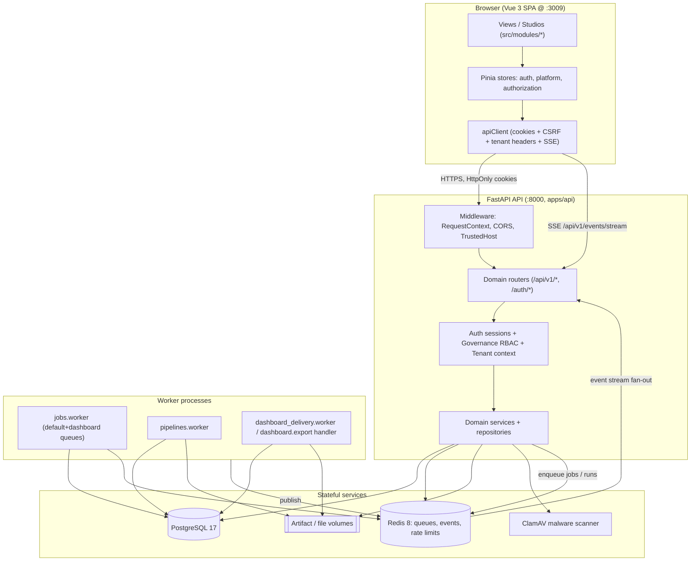
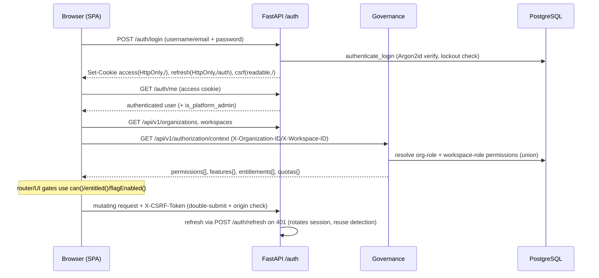

# VIP — Veltrix Intelligence Platform: Platform Architecture

> Read-only architecture analysis produced by verifying claims against source code.
> Scope: repository at commit `2590248` on branch `enhancement/pipeline-dashboard-studios`.
> Nothing in the codebase was modified to produce this document.

---

## 1. Executive overview

VIP (Veltrix Intelligence Platform) is a **multi-tenant, enterprise data-intelligence and
automation platform**. It is delivered as a full-stack application:

- **Frontend**: a Vue 3 + Vite single-page application (SPA) that lives at the repository root
  (`src/`). It is a hybrid app that can run against rich in-browser mocks (`VITE_API_MODE=mock`,
  the development default) or against the live backend (`VITE_API_MODE=live`, required for
  staging/production builds).
- **Backend**: a FastAPI (Python 3.12, async SQLAlchemy) application under `apps/api/`, backed by
  PostgreSQL and Redis, with dedicated worker processes for asynchronous jobs, pipeline execution,
  and dashboard exports/deliveries.

The platform is organized around a set of "studios" and operational surfaces (Connections,
Datasets, Semantic, Dashboards, Pipelines, Reports, plus operations/admin surfaces). A significant
subset — identity, tenancy, governance, connections, datasets, semantic layer, dashboards,
dashboard delivery/exports, pipelines, jobs, files, events, and platform administration — is
implemented with real, database-backed logic. Other surfaces (AI Studio, Automation Studio,
Insights, Marketplace, Reports, Billing, Developer portal) are present as UI with **placeholder /
prototype backends** whose live endpoints intentionally return empty catalogs.

**Verified maturity summary** (details in `VIP_MODULE_CATALOG.md` and
`../reports/VIP_CURRENT_STATE_ASSESSMENT.md`):

| Layer | Maturity |
| --- | --- |
| Identity / sessions / CSRF / lockout | Production-ready |
| Tenancy (org/workspace/membership/invitations) | Implemented with minor gaps |
| Governance (RBAC, feature flags, entitlements, quotas, audit) | Implemented with minor gaps |
| Platform super-admin console | Production-ready |
| Connections + secrets | Production-ready |
| Datasets (catalog/discovery/preview/quality/lineage) | Implemented with minor gaps (PostgreSQL-centric) |
| Semantic models / glossary / query | Implemented with minor gaps (PostgreSQL-only query) |
| Dashboards (studio/versioning/sharing/snapshots) | Production-ready |
| Dashboard exports + delivery | Implemented with minor gaps (no automatic schedule runner) |
| Pipelines (studio/versioning/async runs/artifacts) | Production-ready |
| Async jobs + worker platform | Production-ready |
| Files + storage + malware scan | Production-ready |
| Real-time events (SSE over Redis Streams) | Production-ready |
| AI / Automation / Insights / Marketplace / Reports / Billing / Developer | Prototype / Placeholder |

---

## 2. Platform concept

VIP aims to be an all-in-one environment for:

1. Connecting enterprise data sources (Connection Studio).
2. Registering and profiling datasets and ingesting CSV data (Dataset Studio).
3. Building semantic models, metrics, KPIs, and a business glossary (Semantic Studio).
4. Building dashboards from semantic queries, versioning them, sharing, snapshotting, exporting,
   and delivering them by email on a schedule (Dashboard Studio + Delivery).
5. Authoring and running data pipelines with a node graph, immutable versions, and durable async
   execution (Pipeline Studio).
6. Operating asynchronous jobs and workers, files/object storage, and real-time activity streams.
7. Managing organizations, workspaces, users, memberships, roles, permissions, feature flags,
   entitlements, quotas, and audit (Tenancy + Governance + Platform Admin).

Surfaces for AI assistants/agents, automations, insights, a marketplace, reports, billing, and a
developer/API portal exist in the UI and navigation but are not yet backed by real persistence.

---

## 3. Architecture diagram

---

## 4. Service architecture

Local orchestration is via `docker-compose.yml` (project name `vip`). All services share a single
bridge network `vip_backend`.

| Service | Purpose | Process / image | Port | Depends on | Health check | Persistence |
| --- | --- | --- | --- | --- | --- | --- |
| `postgres` | Primary relational store; also seeds an isolated `vip_test` DB | `vip-postgres:17.10-alpine` (built from `infra/postgres`) | `5432` | — | `pg_isready` | `vip_postgres_data` |
| `redis` | Job queues, Redis Streams events, rate limits, optional caches | `redis:8.0-alpine` | `6379` | — | `redis-cli ping` | `vip_redis_data` (AOF) |
| `clamav` | Malware scanning for file uploads | `clamav/clamav:stable` | — | — | (image default) | `vip_clamav_signatures` |
| `api` | FastAPI app; runs migrations + seeds on startup then serves | built from `apps/api/Dockerfile` | `8000` | postgres, redis, clamav (healthy) | `GET /health` | mounts artifact/file volumes (ro src) |
| `dashboard-storage-init` | One-shot chown of shared data volumes | built from `apps/api` | — | — | run once | writes volume perms |
| `dashboard-worker` | Generic job worker (`default,dashboard` queues) — runs dashboard exports/deliveries + generic handlers | `python -m vip_api.jobs.worker` | — | postgres, redis, api, storage-init | `worker-health.py` | artifact/email/file volumes |
| `pipeline-worker` | Pipeline run executor | `python -m vip_api.pipelines.worker` | — | postgres, redis, api, storage-init | `worker-health.py` | pipeline artifact volume |
| `mysql` (optional) | MySQL connector integration testing only (`--profile connectors`) | `mysql:8.0` | `3306` | — | `mysqladmin ping` | `vip_mysql_data` |

The **frontend is not a Compose service**; it runs via `npm run dev` (`:3009`) or is deployed as a
static bundle (Netlify) that talks to a separately deployed backend.

Important environment variable groups (names only; see `docker-compose.yml` and `.env.example`):
`DATABASE_URL`, `REDIS_URL`, `CORS_ALLOWED_ORIGINS`, `TRUSTED_HOSTS`, `AUTH_*` (session TTLs,
cookie flags, lockout, login rate limit), `PASSWORD_*`, `CSRF_TRUSTED_ORIGINS`, `TENANCY_*`
(tenant headers), `AUTHORIZATION_CACHE_*`, `AUDIT_*`, `GOVERNANCE_FAIL_CLOSED`, `CONNECTION_*`
(encryption key + version, SSRF/network guards, test limits), `METADATA_DISCOVERY_*`, `LINEAGE_*`,
`SEMANTIC_QUERY_*`, `DASHBOARD_*` (limits, export/delivery, download signing key, SMTP/email),
`PIPELINE_*` (run limits, artifact root, download signing key), `JOB_*` (queue prefix, worker
queues/concurrency, lease/heartbeat), `FILE_*` (storage provider/root, upload limits, malware
scanner, download signing key), `CLAMAV_HOST/PORT`.

---

## 5. Frontend architecture

- **Framework / build**: Vue 3.5 (`<script setup>` SFCs) + Vite 6 + TypeScript 5.7. State via Pinia
  2, routing via Vue Router 4, runtime validation via Zod 4.
- **Entry**: `src/main.ts` creates the app + Pinia, applies persisted theme, wires the API client's
  request-context provider and 401/tenant-loss handlers, bootstraps auth **before** mounting the
  router, then mounts. Root component `src/App.vue` selects a layout from `route.meta.layout` and
  hosts global overlays (`ToastHost`, `CommandPalette`, `AriaLive`, skip link).
- **Routing**: `src/app/router/index.ts` — ~50 lazy-loaded routes. A single `beforeEach` guard
  enforces (in order): auth bootstrap → `publicOnly` → `requiresAuth` → `requiresPlatformAdmin`
  (non-disclosing 404) → tenancy bootstrap → `requiresOrganization` / `requiresWorkspace` →
  authorization bootstrap → `permission` (→ `/forbidden`) → `entitlement` (→ `/upgrade`) →
  `featureFlag` (→ 404). By default, authenticated routes (except `home`) require both an
  organization and a workspace.
- **Layouts** (`src/app/layouts`): `AppLayout` (sidebar + topbar + SSE subscription), `StudioLayout`
  (full-bleed editors), `SettingsLayout`, `BlankLayout` (auth/errors).
- **Navigation** (`src/app/navigation.ts`): central `NAV_GROUPS` / `QUICK_CREATE` registry driving
  sidebar, breadcrumbs, and command palette; items can be gated by `permission`, `entitlement`,
  `featureFlag`, `adminOnly`, `platformAdminOnly`.
- **State** (`src/shared/stores`): `auth` (cookie session lifecycle), `platform` (identity + orgs +
  workspaces + org/workspace switching, persists last selection per user), `authorization`
  (permissions/features/entitlements/quotas from `GET /api/v1/authorization/context`), plus
  `theme` and `ui`.
- **API client** (`src/shared/lib/apiClient.ts`): the single HTTP entry point.
  `credentials: 'include'` (cookie sessions), injects `X-Organization-Id` / `X-Workspace-Id` /
  `X-Locale` / `X-Timezone` / `X-Correlation-Id`, sends CSRF header (`X-CSRF-Token` from
  `vip_csrf_token` cookie) on mutating requests, retries idempotent GETs with backoff, coordinates a
  single `POST /auth/refresh` on 401, cancels in-flight requests and triggers logout on hard 401,
  parses binary downloads and SSE streams, and normalizes errors via Zod schemas
  (`src/shared/contracts/apiContracts.ts`).
- **Service selection** (`src/shared/services/serviceFactory.ts`): `defineService(mock, liveFactory)`
  returns the live implementation only when `config.apiMode === 'live'`. Auth, connections,
  pipelines, delivery, admin, platform, governance, tenancy, and platform infrastructure are
  **always live** (no mock). Catalog-style domains (home, dashboards, datasets, semantic, ai,
  insights, marketplace, reports, automation, billing, developer, operations) toggle via
  `defineService`.
- **Authorization UI** (`src/shared/authorization`): `PermissionGate`, `EntitlementGate`,
  `FeatureGate`, `QuotaGate` components mirror the router gates. There is **no `src/shared/permissions/`
  directory**; permissions are plain strings resolved server-side.
- **Design system** (`src/shared/ui`): ~30 `Vip*` primitives (buttons, inputs, table, dialog,
  drawer, menu, badge, alert, spinner, skeleton, tabs, empty state, toasts) plus a command palette.
- **Visualization** (`src/shared/viz`): **custom SVG charts** (`CartesianChart`, `PieChart`,
  `GaugeChart`, `ScatterChart`, `Sparkline`, `VisualRenderer`) — no third-party charting library.
- **Env config** (`src/shared/config/env.ts`): fails closed — staging/production builds require
  `VITE_API_MODE=live` and a valid `VITE_API_BASE_URL`; only local dev may fall back to mock with an
  explicit opt-in flag.

---

## 6. Backend architecture

- **Framework**: FastAPI with an application factory (`apps/api/src/vip_api/main.py::create_application`).
  A lifespan context creates `Database`, `RedisClient`, and `PasswordService` on startup and disposes
  them on shutdown.
- **Middleware**: `CORSMiddleware` (explicit allowlist of headers including tenant + CSRF headers),
  `TrustedHostMiddleware` (unless `TRUSTED_HOSTS=["*"]`), and `RequestContextMiddleware`
  (correlation/request IDs, tenant-header parsing/validation, access logging, metrics).
- **Routing** (`vip_api/api/router.py`): operational routes at root; everything else mounted under
  `API_V1_PREFIX` (`/api/v1`), except `/auth/*` which is unversioned. Domain routers: tenancy,
  governance, platform_admin, home + notifications, catalog, jobs, files, events, connections,
  datasets, dashboards, dashboard_delivery, pipelines (+ artifact router), semantic (models,
  glossary, query).
- **Layering**: routes → dependencies (auth/tenant/governance) → services → (repositories where they
  exist) → SQLAlchemy models. `connections` and `datasets` have explicit repository classes; most
  other domains query models directly inside services with tenant filters.
- **Auth** (`vip_api/auth`): opaque cookie sessions (SHA-256-hashed access/refresh/CSRF tokens),
  Argon2id password hashing, session rotation with refresh-reuse detection, per-account lockout, and
  a per-IP login rate limiter (Redis). See §9.
- **Authorization/governance** (`vip_api/governance`): fixed system roles, permission catalog,
  feature flags, entitlements, atomic quotas, and persistent audit. Enforced primarily via FastAPI
  dependency classes (`RequireGovernance`, `require_permission`, `require_capability`) and secondarily
  via service-layer `authorize*` helpers. A `route_policy` test asserts every `/api/v1/*` route
  declares a governance/tenant dependency.
- **Tenancy** (`vip_api/tenancy`): request-scoped `TenantContext` resolved from `X-Organization-ID`
  (required) and `X-Workspace-ID` (optional), validated against membership; unauthorized access
  returns non-disclosing 404s. Repositories filter by tenant columns.
- **Cross-cutting** (`vip_api/core`): typed `Settings` with production validators, structured JSON
  logging with secret redaction, stable `ApplicationError` codes + exception handlers, request
  context vars.
- **Observability**: `/health`, `/ready`, `/api/v1/version` operational endpoints; access logs and
  metrics counters (e.g. late scheduled jobs); worker heartbeats persisted to `worker_heartbeats`.
- **Caching**: config TTL flags for authorization/feature-flags/entitlements/quotas exist but the
  runtime caches are **not implemented** (authorization is resolved from the DB per request;
  `AUTHORIZATION_CACHE_ENABLED` defaults false).

---

## 7. Database architecture

- **Engine**: PostgreSQL 17 via async SQLAlchemy (`asyncpg`). `Base` declarative model with a
  strict naming convention (`vip_api/database/base.py`). No shared mixin classes — timestamps,
  `deleted_at`, `row_version`, and tenant columns are declared inline per model.
- **Scale**: ~76 tables across 11 model modules (auth, tenancy, governance, connections, datasets,
  semantic, dashboards, dashboard_delivery, pipelines, jobs, files).
- **Tenant scoping**: most resource tables carry `organization_id` + `workspace_id`, with pervasive
  **composite foreign keys** `(organization_id, workspace_id) → workspaces(organization_id, id)` and
  tenant-scoped unique constraints (e.g. `uq_dashboards_tenant_slug`, `uq_jobs_tenant_idempotency`)
  and indexes (e.g. `ix_connections_tenant_health`, `ix_jobs_queue_claim`).
- **Patterns**: soft delete (`deleted_at` on users/orgs/workspaces/files), optimistic locking
  (`row_version` on dashboards, pipelines, jobs, files, dashboard exports/schedules), partial unique
  indexes (optional-email uniqueness, default-workspace uniqueness), and native PostgreSQL enums
  (`vip_user_status`, `vip_organization_status`, `vip_workspace_status`, membership/invitation
  statuses).
- **Migrations**: Alembic, async env (`apps/api/alembic/env.py`). 19 migration files forming a
  single linear head — current head `20260728_0016` (`resource_access_entries`). The chain is
  overwhelmingly additive; the only notable non-additive upgrade operations are the RBAC cut-over
  (`53957b92b086`, drops enum `role` columns after migrating to `role_id`) and the identity change
  (`20260728_0013`, makes email nullable + partial unique index). External warehouse tables
  (`vip_b5_*` and registered dataset source tables) are excluded from autogenerate compare.

See `../reports/VIP_CURRENT_STATE_ASSESSMENT.md` for migration risk notes and the full model list in
the "Database and migrations" section of `VIP_REPOSITORY_GUIDE.md`.

---

## 8. Worker and job architecture

Three worker roles exist; in Compose only two processes run (`jobs.worker` and `pipelines.worker`).

- **Generic job platform** (`vip_api/jobs`): durable `jobs` table with attempts, progress, logs,
  errors, results, and a dead-letter queue; Redis queue (`JOB_QUEUE_PREFIX`) plus DB claim with
  `FOR UPDATE SKIP LOCKED`; leases + heartbeats; retry with backoff; extensible handler registry
  (`platform.noop`, `dataset.quality`, `dashboard.export`, `platform.file_lifecycle`). Deployed as
  the `dashboard-worker` service on the `default,dashboard` queues.
- **Pipeline worker** (`vip_api/pipelines/worker.py`): claims `pipeline_runs`
  (queued/retrying/expired-lease), executes the published snapshot in-process (source reads via
  asyncpg, transform nodes, formula evaluation), writes node/attempt/log rows and artifacts, and
  publishes events. Dedicated `pipeline-worker` process.
- **Dashboard delivery worker** (`vip_api/dashboard_delivery/worker.py`): claims `dashboard_exports`
  with `FOR UPDATE SKIP LOCKED`, re-authorizes tenant, renders (PDF via ReportLab, PNG via Pillow,
  JSON, CSV), stores artifacts, and sends email for delivery runs. In Compose this runs via the
  `dashboard.export` job handler on the shared job worker rather than as a separate process.
- **Gap**: there is **no automatic scheduler daemon** that scans `dashboard_delivery_schedules` for
  due `next_run_at` — recurring deliveries are CRUD + on-demand "test delivery" only. `scheduling.py`
  computes next-run for daily/weekly/monthly/one-time but does not parse cron expressions.

Real-time updates: `vip_api/events` publishes tenant-scoped Redis Streams
(`{prefix}:events:{org}:{ws}`) and exposes a resumable SSE endpoint
(`GET /api/v1/events/stream`, `Last-Event-ID`/cursor). The `AppLayout` subscribes and invalidates
queries on job/file/export events.

---

## 9. Authentication and authorization flow

- **Sessions**: opaque `token_urlsafe(32)` values stored as SHA-256 with purpose prefixes; access
  cookie path `/`, refresh cookie path `/auth`, CSRF cookie readable. Idle + absolute TTLs; sliding
  `last_seen_at` update.
- **CSRF**: origin/referer allowlist + double-submit cookie/header + session-bound CSRF hash;
  required on all mutating routes via `Depends(require_csrf)` (not on login).
- **Account controls**: per-account lockout (default 5 attempts / 15 min, revokes sessions),
  per-IP login rate limit (Redis, fails open), account-status checks (ACTIVE only; soft-deleted
  blocked). `must_change_password` is stored but **not enforced**.
- **Password reset**: service + token model exist and an admin-initiated reset exists
  (`POST /api/v1/platform/users/{id}/reset-password`), but there are **no self-service
  forgot/reset routes** and no email delivery for it.
- **RBAC model**: fixed **system roles** (organization owner/admin/member, workspace admin/editor/
  viewer/restricted_user). No custom roles, no direct-user permissions, no groups. Permissions are
  the **union** of org-role + workspace-role permission keys. Enforcement is fail-closed (unknown
  permission keys are denied). Explicit deny exists only in the not-yet-wired resource ACL evaluator.
- **Platform super-admin**: boolean `users.is_platform_admin` (granted via CLI). Enforced by a
  dependency that returns a non-disclosing 404 to non-admins; independent of tenant RBAC; all
  platform actions are audited.

---

## 10. Tenant-isolation model

- **Scopes**: platform-wide (super-admin flag), organization-level (org membership + role), and
  workspace-level (workspace membership + role). Resource-level ACLs are designed
  (`governance/resource_access.py` + `resource_access_entries` table) but **not enforced in any
  route yet** (Slice A foundation; verified by direct read + grep).
- **Resolution**: `RequestContextMiddleware` parses/validates `X-Organization-ID`/`X-Workspace-ID`;
  `get_tenant_context` loads the org via membership (`OrganizationRepository.get_authorized`) and,
  when present, the workspace; builds an immutable `TenantContext`.
- **Enforcement**: repository/service queries filter by `organization_id` (+ `workspace_id`);
  path `{organization_id}` is compared to the header-derived context (`ensure_authorization_scope`);
  cross-tenant queries occur only in the explicitly super-admin-gated `platform_admin` service.
- **Known gaps**: `TENANCY_REQUIRE_WORKSPACE_BY_DEFAULT` is unused; tenancy audit is log-only (not
  persisted to `audit_events`); authorization is not cached.

---

## 11. Storage and export architecture

- **File storage** (`vip_api/files`): pluggable provider (`FILE_STORAGE_PROVIDER`, default `local`
  under `FILE_STORAGE_ROOT`). Streaming uploads, SHA-256, MIME/extension validation, optional ClamAV
  malware scan, content versioning, soft delete, and HMAC single-use download tokens
  (`FILE_DOWNLOAD_SIGNING_KEY`). Rate-limited uploads.
- **Dashboard exports** (`vip_api/dashboard_delivery`): async job renders PDF/PNG/JSON/CSV into
  `DASHBOARD_ARTIFACT_ROOT`, enforces size/attempt limits and retention, and issues HMAC download
  tokens (`DASHBOARD_DOWNLOAD_SIGNING_KEY`) + a token-gated download route.
- **Pipeline artifacts** (`vip_api/pipelines`): run outputs stored under `PIPELINE_ARTIFACT_ROOT`
  with HMAC signed download URLs (`PIPELINE_DOWNLOAD_SIGNING_KEY`) served by a dedicated artifact
  router.
- **Email delivery**: `FileEmailProvider` (writes `.eml` to an outbox volume, default) or
  `SmtpEmailProvider` (real SMTP) selected by `DASHBOARD_EMAIL_PROVIDER`.

All artifact/file paths are Docker volumes (`vip_dashboard_artifacts`, `vip_dashboard_email_outbox`,
`vip_pipeline_artifacts`, `vip_files`) chowned by the one-shot `dashboard-storage-init` service.

---

## 12. Major data flows

- **Read/query flow**: dashboards → widget queries → `semantic.query.execute_query` → compiled,
  parameterized, read-only SQL over a tenant PostgreSQL connection (asyncpg), bounded by
  `SEMANTIC_QUERY_*` limits; optional Redis result cache (disabled by default).
- **Ingestion flow**: CSV upload/ingest → PostgreSQL table creation + bulk insert → metadata
  discovery registers dataset fields.
- **Async job flow**: API creates a `Job`/run row and enqueues to Redis → worker claims (Redis or DB
  `SKIP LOCKED`) with a lease → executes handler → writes progress/logs/attempts → success/result or
  retry/dead-letter → publishes events → SSE fan-out to the browser.
- **Export/delivery flow**: request export → `DashboardExport` row + job enqueue → worker renders →
  artifact stored → download token issued → audited → retention cleanup.

---

## 13. Local development architecture

- **Backend**: `docker compose up --build` starts postgres, redis, clamav, api (which runs
  `alembic upgrade head` + seeds on startup), the storage-init one-shot, and the two workers.
  Operational endpoints: `http://localhost:8000/health`, `/ready`, `/api/v1/version`.
- **Frontend**: `npm ci` then `npm run dev` (`http://localhost:3009`). Default `VITE_API_MODE=mock`;
  set `VITE_API_MODE=live` + `VITE_API_BASE_URL=http://localhost:8000` to exercise the real backend.
- **First user**: `python -m vip_api.cli create-user` (from `apps/api`); grant super-admin with
  `python -m vip_api.cli grant-platform-admin <email>`. Seed helpers exist for governance,
  connection types, dataset catalogs, semantic layer, dashboard governance/demo, and a
  multi-tenancy demo.
- **Deployment**: Netlify hosts only the static frontend (`netlify.toml`); the backend must be
  deployed separately with HTTPS, correct CORS/CSRF origins, secure cookies, trusted hosts,
  PostgreSQL, Redis, workers, and file storage.
