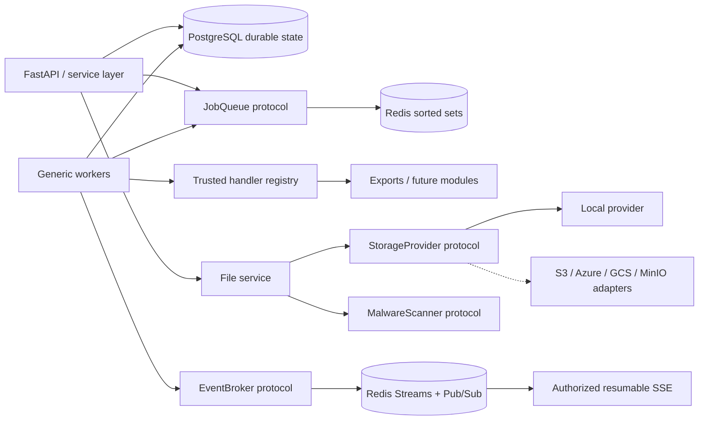
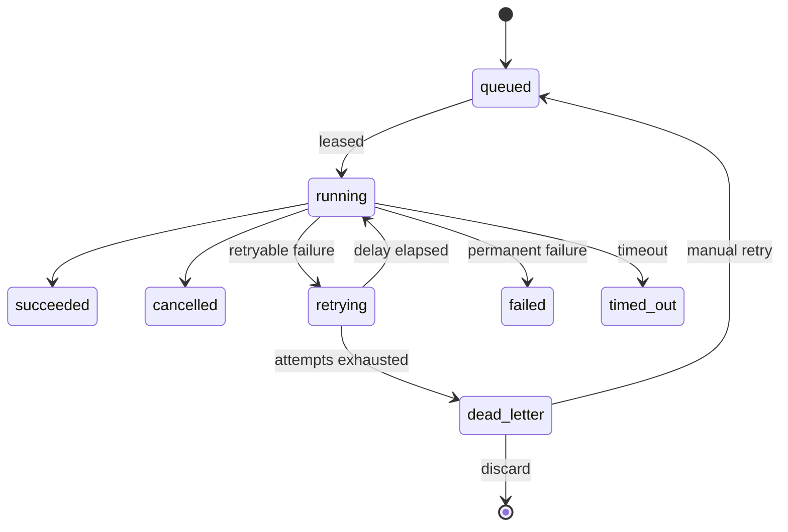

# B8 Async Jobs, Files, and Real-Time Infrastructure

Phase B8 is shared platform infrastructure. Feature modules submit trusted handlers to the job
registry; they do not create their own queues, workers, storage clients, download tokens, or event
transports. Dashboard exports are the first migrated consumer. Existing dashboard and pipeline API
contracts remain unchanged.

## Architecture



PostgreSQL is authoritative. Redis accelerates dispatch and event fan-out; workers also scan the
database so a lost Redis enqueue cannot lose a job. Every query for user-visible jobs and files
contains organization and workspace predicates.

## Job lifecycle



Jobs have immutable payload hashes, idempotency keys unique within tenant/type, attempts, progress
history, safe logs, internal error records, results, optimistic row versions, correlation IDs,
worker ownership, renewable leases, and persisted heartbeats. Workers use `FOR UPDATE SKIP LOCKED`,
bounded concurrency, `asyncio` timeouts, cancellation polling, exponential/fixed/linear/custom retry
policies, and expired-lease recovery. Terminal writes are fenced by the active lease owner and a
final cancellation check, so a stale or cancelled worker cannot overwrite recovered state. Recovery
closes the abandoned attempt and either schedules a bounded retry or writes the error and dead-letter
record when the maximum attempt count is reached. SIGINT/SIGTERM stops new claims and drains active
work.

Run a worker:

```bash
cd apps/api
python -m vip_api.jobs.worker
```

`JOB_WORKER_QUEUES` selects comma-separated queues. Scale by running identical workers. Do not
register handlers from request data; handler registration is application code.

## Queue and retry design

`JobQueue` exposes enqueue, dequeue, priority, delay and metrics. `RedisJobQueue` uses atomic Lua
pop from sorted sets. Delayed jobs remain invisible until their availability bucket. Database
fallback makes enqueue idempotent and restart-safe. Retryable exceptions must use
`RetryableJobError`; unknown and permanent exceptions fail closed. Exhausted retryable jobs enter
the dead-letter table with the safe failure, internal trace, payload snapshot, worker, and attempt
count.

## File architecture

The upload pipeline is:

```text
stream -> byte limit -> filename/type validation -> content signature -> SHA-256
       -> malware scanner -> storage provider -> metadata/version/scan audit -> ready
```

Bodies are streamed and never buffered in memory. Declared MIME type must match the filename
extension, parameters are normalized before signature comparison, and executable/archive magic
bytes are rejected even when the file is renamed. Local keys are generated from tenant,
workspace, file, version, and a random object name. Client filenames never become filesystem
paths. `StorageProvider` prevents business services from depending on local or cloud APIs.
`MalwareScanner` supports provider replacement. The `noop` scanner is restricted to
development/test; production settings reject it.

Downloads use 384-bit random tokens; only SHA-256 token hashes are stored. Tokens bind the file,
organization, workspace, and user, expire, and are single use. Storage keys and paths never appear
in API responses. Downloads stream from the provider with `private, no-store`.

Replacement creates a new monotonically increasing version. Restore also creates a new version,
preserving history. Deletion is soft; retention metadata is persisted for maintenance jobs.

## Real-time events

`EventBroker` publishes tenant/workspace-qualified Redis Stream entries and Pub/Sub notifications.
Streams retain a bounded history. `/api/v1/events/stream` uses authenticated fetch-based SSE,
requires `events.subscribe`, and validates tenant/workspace context. `Last-Event-ID` resumes from a
known stream cursor. Keepalive comments prevent idle intermediary timeouts. The frontend uses the
central API client because native `EventSource` cannot send tenant headers.

Event payloads contain safe module data only. Subscribers cannot select another tenant through a
query parameter or channel name.

## API inventory

All endpoints require authentication, organization/workspace context, and server-side RBAC:

- `GET /api/v1/jobs`, `/jobs/{id}`, `/jobs/{id}/progress`, `/jobs/{id}/logs`
- `GET /api/v1/jobs/metrics`, `/jobs/platform-metrics`, `/jobs/workers`
- `POST /api/v1/jobs/{id}/cancel`, `/jobs/{id}/retry`
- `GET /api/v1/jobs/dead-letters`
- `POST /api/v1/jobs/dead-letters/{id}/discard`
- `POST /api/v1/files` with raw body, `X-File-Name`, and `Content-Type`
- `GET /api/v1/files`, `/files/{id}`, `/files/{id}/versions`
- `PUT /api/v1/files/{id}/content`
- `POST /api/v1/files/{id}/versions/{version}/restore`
- `POST /api/v1/files/{id}/download`
- `GET /api/v1/files/download/{single-use-token}`
- `DELETE /api/v1/files/{id}`
- `GET /api/v1/events/stream`

Dashboard export APIs are unchanged and create a linked generic `export` job handled by
`dashboard.export`.

## Deployment and operations

```bash
docker compose up -d --build
docker compose logs -f dashboard-worker
docker compose exec api alembic current
docker compose exec postgres psql -U vip -d vip -c \
  "select worker_id,status,queue_name,active_jobs,last_seen_at from worker_heartbeats"
```

Alert on growing queued/dead-letter counts, missing worker heartbeats, repeated lease recovery,
upload/scan failures, and storage capacity. Back up PostgreSQL and provider objects together.
Rotate Redis without losing job state; event history may be unavailable during that interval.

For cloud storage, implement `StorageProvider`, configure credentials through the deployment secret
manager, and register the provider in `storage_provider`. For a broker migration, implement
`EventBroker`; routes and feature handlers require no changes.

## Validation

```bash
cd apps/api
ruff check .
ruff format --check .
mypy src tests
pytest -m "not integration"
RUN_INTEGRATION_TESTS=1 pytest
alembic check
```

Security tests cover tenant-qualified job lookups, path traversal, expiring single-use downloads,
Redis queue behavior, resumable tenant channels, and clean migration upgrade/downgrade.

## Known operational boundaries

- Cloud storage and production malware engines are provider interfaces, not credentialed
  integrations in source control.
- Redis Streams is the initial broker; WebSocket, Kafka, RabbitMQ, and Azure Service Bus are
  adapter extensions.
- Pipeline APIs remain on the proven B7 worker during this compatibility phase; new long-running
  modules must use the B8 worker, and pipeline migration can be performed without an API change.
