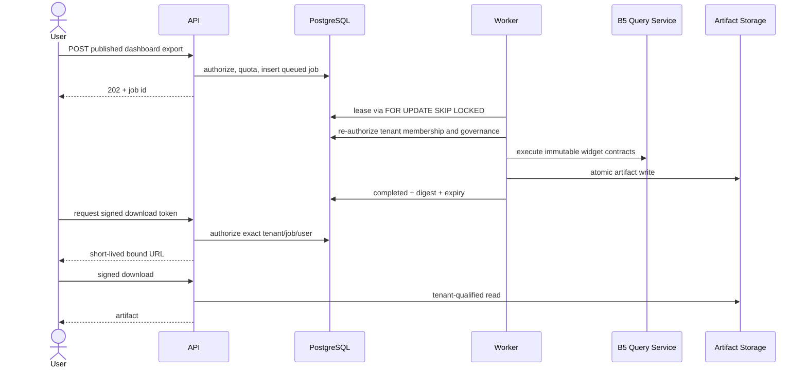
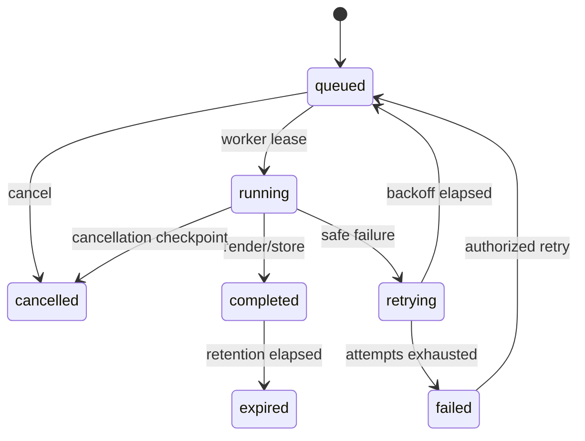

# Dashboard exports, delivery, and result cache

## Scope and architecture

B6.5 adds durable asynchronous exports, immutable-version rendering, scheduler-ready delivery
definitions, provider-backed email delivery, and an optional tenant-safe widget result cache. It
does not add a scheduler daemon or SMTP credentials. The worker contract deliberately uses durable
status, availability, attempt, progress, cancellation, and lease fields so Phase B7 can adopt the
records behind a common job adapter without changing the HTTP API.



The renderer provider registry contains PDF, PNG, JSON, and table-only CSV providers. PDF and PNG
are real byte renderers (ReportLab and Pillow), not placeholders. A render document is assembled
only from an immutable published `DashboardVersion`; draft state is never accepted. Metadata is
limited to dashboard/version/tenant/generated time. SQL, credentials, storage paths, stack traces,
query identifiers, and connection metadata are excluded.



## Security boundaries

- Every query and mutation is scoped by organization, workspace, dashboard, authenticated user,
  RBAC permission, feature, entitlement, and quota where applicable.
- Composite foreign keys prevent tenant-crossed dashboard, version, schedule, run, and export
  references. Workers repeat membership and governance authorization after leasing.
- Only published versions can be rendered. Restores create draft state and require a later publish.
- Artifact keys are validated tenant-qualified values below a configured root. Paths never appear
  in API responses.
- Downloads require a random, short-lived HMAC token bound to user, organization, workspace,
  export, expiry, and nonce. Tokens cannot be reused for another principal or tenant.
- Email recipients are validated, template values are escaped, and provider failures return only
  stable safe errors. SMTP is intentionally outside the repository.

## Delivery architecture

Schedules support one-time, daily, weekly, monthly, and validated five-field cron-ready
expressions. Each definition pins the published version, filters, timezone, recipient/CC/BCC
lists, subject, attachment format, retry policy, status, last run, and next run. This phase exposes
CRUD, history, preview, and test-delivery APIs; a future B7 scheduler may select due definitions
without changing their schema.

Test delivery creates an auditable delivery run and asynchronous export. After rendering, the
worker composes escaped HTML and invokes an `EmailProvider`. Local Docker uses the file provider,
which writes RFC-compliant `.eml` messages to the `dashboard-email-outbox` volume. Production must
register a managed provider; no SMTP secret is stored in schedules or artifacts.

## Tenant-safe result cache

Caching is off by default. When `DASHBOARD_QUERY_CACHE_ENABLED=true`, Redis keys hash all access
and content dimensions: organization, workspace, dashboard, published version, semantic-model
version, joined dataset versions, widget contract, filters, user, resource scope, permissions,
features, entitlements, locale, and timezone. Values are bounded and expire using
`DASHBOARD_QUERY_CACHE_TTL_SECONDS`. Redis errors fail open to a normal query.

Because mutable security/content revisions are included in the key, dashboard publish/restore,
semantic or dataset updates, permission/share changes, logout, and workspace switch immediately
select a different namespace. Old entries become unreachable and expire naturally. Draft previews
are never cached.

## API

All paths are below `/api/v1`:

- `POST|GET /dashboards/{dashboard_id}/exports`
- `GET /dashboard-exports/{export_id}`
- `POST /dashboard-exports/{export_id}/cancel`
- `POST /dashboard-exports/{export_id}/retry`
- `POST /dashboard-exports/{export_id}/download-token`
- `GET /dashboard-exports/{export_id}/download?token=...`
- `GET|POST /dashboards/{dashboard_id}/deliveries`
- `GET /dashboard-deliveries`
- `PUT|DELETE /dashboard-deliveries/{schedule_id}`
- `GET /dashboard-deliveries/{schedule_id}/history`
- `POST /dashboard-deliveries/{schedule_id}/test`
- `POST /dashboards/{dashboard_id}/deliveries/preview-email`

The generated OpenAPI document is the field-level contract.

## Operations and development

Apply migrations and seed governance before starting the worker:

```powershell
docker compose up -d postgres redis
docker compose run --rm api alembic upgrade head
docker compose run --rm api python -m vip_api.cli seed-dashboard-governance
docker compose up -d api dashboard-worker
docker compose logs -f dashboard-worker
```

Start the entire local stack with `docker compose up -d --build`. The UI is
`http://localhost:3009`; API health is `http://localhost:8000/health`. Export artifacts and local
email outbox messages live in named Docker volumes, not the source tree.

Relevant settings are documented in `.env.example`. For production, provide a strong
`DASHBOARD_DOWNLOAD_SIGNING_KEY`, durable artifact provider/root, and a registered managed email
provider. Keep query caching disabled until Redis capacity, TTL, and tenant-isolation monitoring
have been reviewed.

Troubleshooting:

- Jobs remain queued: inspect `docker compose ps dashboard-worker` and worker logs.
- `DASHBOARD_EMAIL_PROVIDER_UNAVAILABLE`: configure a registered provider; `file` is local only.
- Downloads return 403: request a fresh token as the same active user and tenant context.
- CSV returns 422: CSV supports exactly one visible table widget.
- Cache appears unused: confirm the opt-in flag, Redis readiness, published viewer mode, and TTL.

Run backend gates with `make backend-quality` (or `python apps/api/scripts/backend_quality.py`) and
frontend gates with `pnpm lint`, `pnpm format:check`, `pnpm typecheck`, `pnpm test`, `pnpm build`,
`pnpm test:e2e`, and `pnpm test:a11y`.
